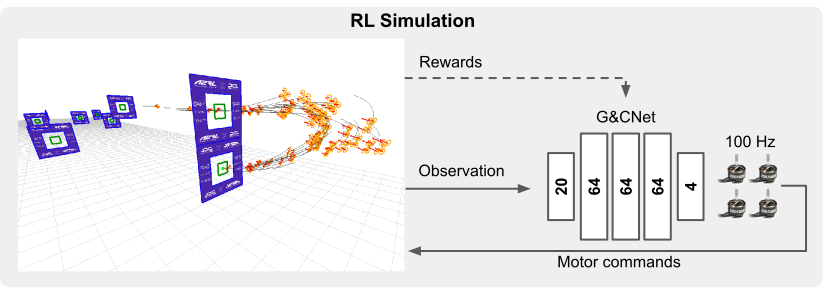

# optimal_quad_control_RL



Training code for the G&CNet neural controller from MonoRace — our
monocular-vision drone racing system that won the 2025 Abu Dhabi
Autonomous Drone Racing Championship.

This repo covers the **controller** only: an MLP policy trained with
Stable-Baselines3 PPO in a vectorized quadcopter racing environment.
The full perception + planning + control stack, and the rest of the
experimental results, are described in the paper.

For the gate-detection dataset see
[tudelft/MonoRaceGate](https://github.com/tudelft/MonoRaceGate).

## Citation

Free to use. Please refer to the corresponding paper:

```
@misc{2601.15222,
  Author = {Stavrow A. Bahnam and Robin Ferede and Till M. Blaha and Anton E. Lang and Erin Lucassen and Quentin Missinne and Aderik E. C. Verraest and Christophe De Wagter and Guido C. H. E. de Croon},
  Title = {MonoRace: Winning Champion-Level Drone Racing with Robust Monocular AI},
  Year = {2026},
  Eprint = {arXiv:2601.15222},
}
```

## Install

```
conda env create -f environment.yaml
conda activate quad_race
```

## Usage

Train from an options file (defaults to `options.json`):

```
python train.py [options_path]
```

Simulate a trained model (opens an OpenCV window; key bindings print
on launch):

```
python simulate.py <model.zip>
```

e.g. to fly M16, the fastest policy from the paper:

```
python simulate.py best_models/M16/220000000.zip
```

Find the best checkpoint of a training run by tensorboard reward:

```
python best_model.py <model_dir>
```

Prints the path of the `.zip` with the highest `rollout/ep_rew_mean`.

Export a trained policy to a C source file for onboard deployment:

```
python export_c.py <model.zip>
```

By default this reads `options.json` alongside the model for the flight
plan and writes `<model_dir>/<folder_name>.c`. Override with
`--name`, `--output`, `--options` as needed.

## best_models/

Contains every controller discussed in the paper (M16…M23). Each folder
contains the PyTorch checkpoint (`.zip`), the exported onboard C code
(`.c`), and the `options.json` used to train it.

## Layout

- `train.py` — PPO training loop
- `simulate.py` — roll out and animate a trained policy
- `best_model.py` — pick the best checkpoint from a training run
- `export_c.py` — dump a trained policy as a C source file
- `options.json` — training / env / PPO config template
- `quad_race/` — gym env (`environment.py`, class `QuadRace`), utils
- `quadcopter_animation/` — OpenCV-based 3D visualization
- `flight_plans/` — waypoint/gate definitions
- `best_models/` — curated trained policies (M16…M23)
